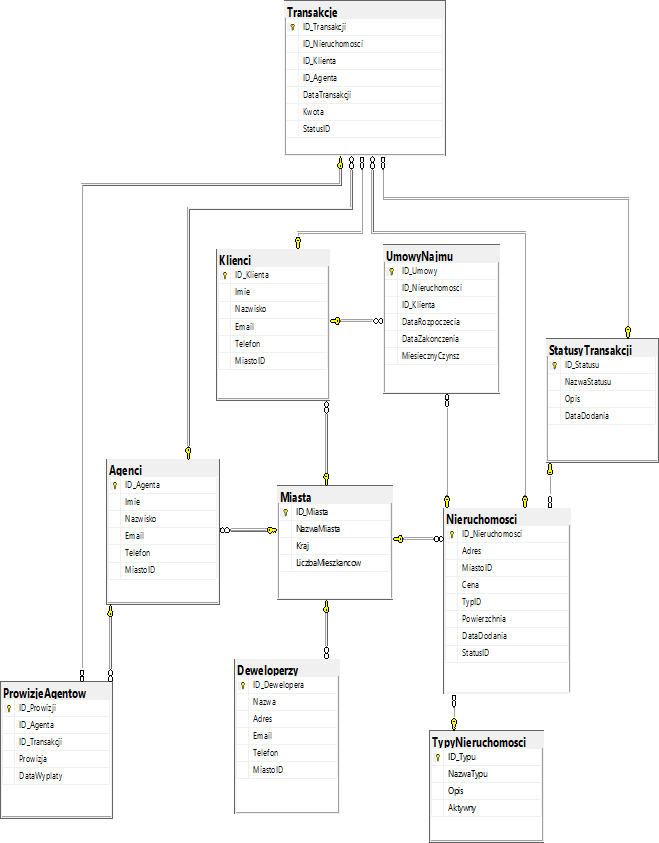

# SQL Database Project: Real Estate Company Database

## Basic Information and Project Components

**Project**: Comprehensive database for a real estate company.  
**Objective**: Create a database to manage real estate properties, clients, agents, developers, and transactions.

**Tools and Techniques**:
- **SQL**: Database creation, management, and querying.
- **Database Model**: Entity-relationship diagram to design the database schema.

**Business Focus**: Efficient management of real estate listings, clients, agent activities, transactions, rental agreements, and agent commissions.

---

## Database Schema

The database schema includes the following tables:
- **Cities (Miasta)**
- **Property Types (TypyNieruchomosci)**
- **Transaction Statuses (StatusyTransakcji)**
- **Properties (Nieruchomosci)**
- **Clients (Klienci)**
- **Agents (Agenci)**
- **Transactions (Transakcje)**
- **Agent Commissions (ProwizjeAgentow)**
- **Developers (Deweloperzy)**
- **Rental Agreements (UmowyNajmu)**

---

## Steps

### SQL Script

The SQL script (`SQL_PROJEKT.sql`) includes:
1. Database creation and setup.
2. Table definitions with constraints.
3. Indexes for optimization.
4. Sample data insertion.
5. View creation for data analysis.
6. Functions and stored procedures for advanced querying.
7. Triggers for data integrity.

You can find the complete script in the [scripts directory](scripts/SQL_PROJEKT.sql).

### Documentation

The detailed documentation (`Project_Database_T_SQL.docx`) includes:
- Project description.
- SQL code explanations.
- Sample queries and results.

You can find the documentation in the [docs directory](docs/Project_Database_T_SQL.docx).

---

## Usage

1. **Setup the Database**:
    - Run the SQL script to create the database and populate it with sample data.
2. **Query the Database**:
    - Use the provided views, functions, and procedures to analyze the data and generate reports.
3. **Maintain Data Integrity**:
    - Utilize the triggers to ensure data consistency and integrity.

---

## Conclusion

This project demonstrates the creation of a comprehensive SQL database for a real estate company, facilitating efficient data management and insightful analysis.

---

## License

This project is licensed under the MIT License - see the [LICENSE](../LICENSE) file for details.

