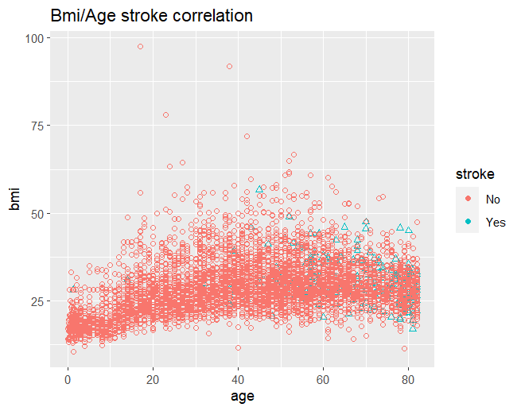

# R Programming Project: Stroke Prediction Analysis

## Basic Information and Project Components

**Project**: Data analysis of stroke prediction dataset.  
**Objective**: Analyze and visualize stroke data to identify patterns and correlations.

**Tools and Techniques**:
- **R**: Data preparation, cleaning, analysis, and visualization.
- **ggplot2**: Visualization.
- **tidyverse**: Data manipulation.

**Data Source**: [Stroke Prediction Dataset](https://www.kaggle.com/datasets/fedesoriano/stroke-prediction-dataset)

---

## Steps

### Data Preparation

1. Loaded and cleaned the stroke prediction dataset.
2. Converted necessary columns to appropriate data types.
3. Handled missing values and outliers.

### Data Analysis

1. Explored correlations between stroke and various factors (e.g., age, hypertension).
2. Used visualization techniques to identify patterns.

### Data Visualization

- Age distribution by gender and stroke status.
- Age distribution by smoking status and stroke.
- Age distribution by work type and stroke.
- BMI and age stroke correlation.
- Stroke and average glucose level comparison.
- Work type by hypertension, marital status, and stroke.

---

## Results and Insights

### Age Distribution

- Observed that stroke occurrence increases with age, especially in the 60+ age group.

### Hypertension and Stroke

- Identified a significant correlation between hypertension and stroke occurrence.

### Smoking Status and Stroke

- Analyzed the impact of smoking on stroke, finding that former smokers had a higher incidence of stroke.

---

## Screenshots

- Below are some visualizations created for this project:

### Age Distribution by Gender and Stroke Status

### Age Distribution by Smoking Status and Stroke

### Age Distribution by Work Type and Stroke

### BMI and Age Stroke Correlation

### Stroke and Average Glucose Level Comparison

### Work Type by Hypertension, Marital Status, and Stroke

### Work Type Distribution by Hypertension and Stroke

---

## Data File

The dataset used in this project can be downloaded from the following link:

- [healthcare-dataset-stroke-data.csv](data/healthcare-dataset-stroke-data.csv)

---

## Conclusion

This project demonstrates the use of R for data analysis and visualization, providing insights into the factors associated with stroke occurrence.

---

## License

This project is licensed under the MIT License - see the [LICENSE](../LICENSE) file for details.
