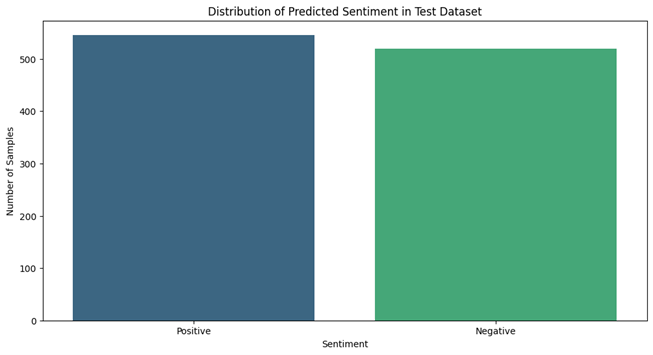
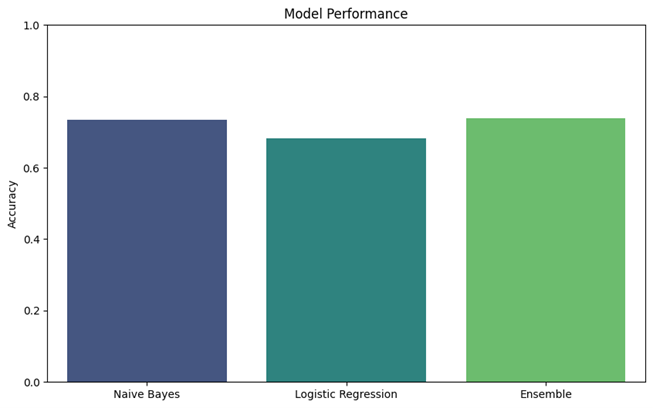

# Python Sentiment Analysis Project: Movie Review Sentiment Analysis

## Basic Information and Project Components

**Project**: Sentiment analysis of movie reviews.  
**Objective**: Analyze and predict sentiment in movie reviews using various machine learning models.

**Tools and Techniques**:
- **Python**: Data preparation, cleaning, analysis, and visualization.
- **scikit-learn**: Machine learning models.
- **Hugging Face Transformers**: Sentiment analysis using pre-trained models.
- **Matplotlib and Seaborn**: Visualization.

**Data Source**: [Rotten Tomatoes Movie Review Dataset](https://huggingface.co/datasets/cornell-movie-review-data/rotten_tomatoes)

---

## Steps

### Data Preparation

1. Loaded and cleaned the movie review dataset.
2. Converted necessary columns to appropriate data types.
3. Tokenized and lemmatized the text data.
4. Extracted BERT embeddings for the text data.

### Data Analysis

1. Explored correlations between text features and sentiment labels.
2. Used visualization techniques to identify patterns.

### Data Visualization

- Distribution of predicted sentiment in the test dataset.
- Model performance comparison.

---

## Results and Insights

### Sentiment Distribution

- Observed that the sentiment distribution in the test dataset is balanced between positive and negative.

### Model Performance

- Evaluated the performance of Naive Bayes, Logistic Regression, and Ensemble models.
- Found that the ensemble model performed the best with an accuracy of 73.83%.

---

## Screenshots

- Below are some visualizations created for this project:

### Distribution of Predicted Sentiment in Test Dataset

### Model Performance

---

## Data File

The dataset used in this project can be downloaded from the following link:

- [Rotten Tomatoes Movie Review Dataset](https://huggingface.co/datasets/cornell-movie-review-data/rotten_tomatoes)

---

## Conclusion

This project demonstrates the use of Python for sentiment analysis, providing insights into the factors associated with movie review sentiments.

---

## License

This project is licensed under the MIT License - see the [LICENSE](../LICENSE) file for details.
